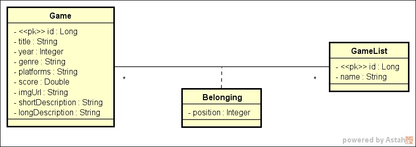

# intesivo-springboot-devsuperior
Repositório referente ao evento Intensivão Spring Java promovido por DevSuperior, professor Nélio Alves.

## Modelo de domínio DS List

### Conteúdos abordados durante primeira aula (08/05/2023)

- Conceitos 
  - Sistemas WEB e recursos
  - Cliente/servidor, HTTP e JSON
  - Padrão REST para API's Web

- Estruturação de projeto Spring REST
- Entidades e ORM
- Database seeding (H2 Database)
- Controller, Service e Repository
- Padrão DTO (Data Transfer Object)

### Conteúdos abordados durante segunda aula (09/05/2023)

- Relacionamentos ManyToMany e ManyToOne
- Classe de associação (@Embedded id)
- Consultas SQL no Spring Data JPA
- Projections
- Endpoints customizados

### Conteúdos abordados durante a terceira aula (10/05/2023)

- Dicas de currículo e portfólio
- Perfis de projeto
- Ambiente local com Docker Compose
- Processor de deploy (Railway) com CI/CD
- Configuração do CORS

### Conteúdos abordados durante a quarta aula (11/05/2023)

- Design e implementação de endpoint
- Verbo HTTP e idempotência
- Atingindo o nível Ultimate Java Spring
